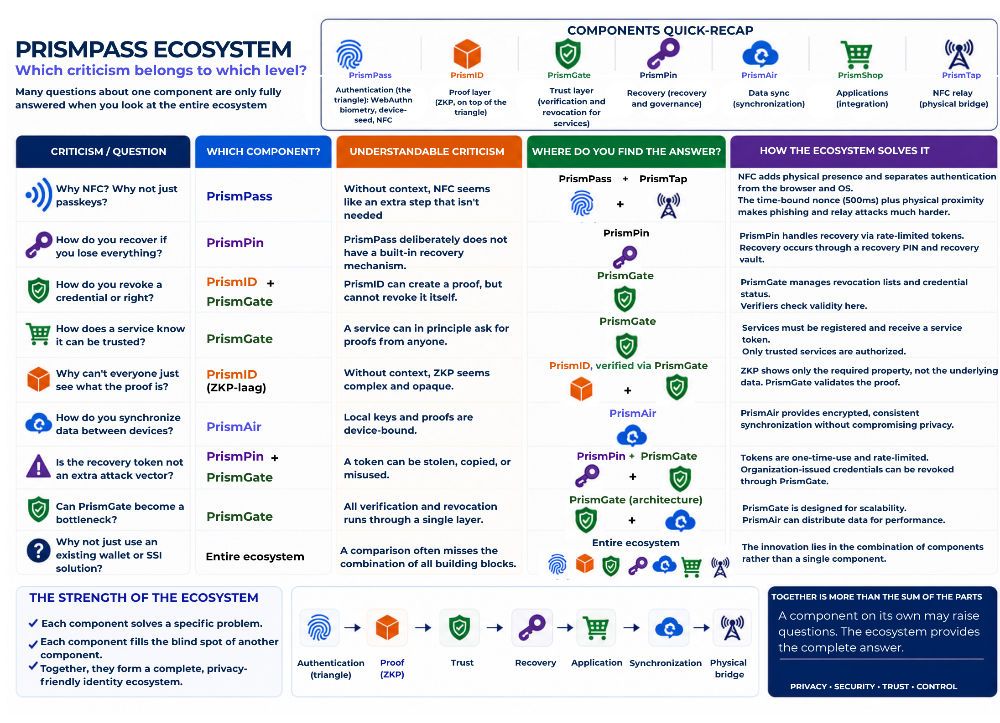
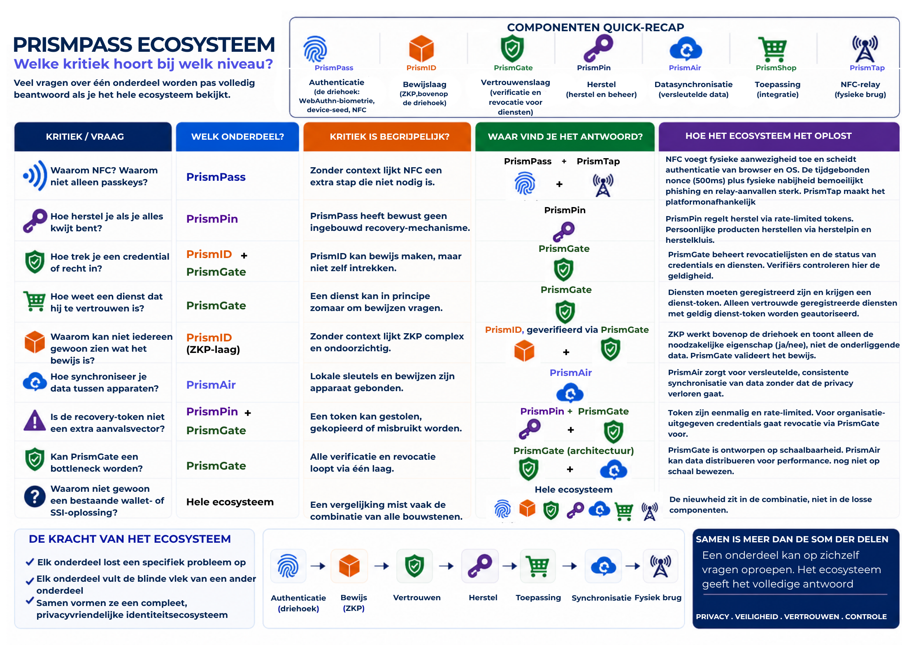

# Prism Ecosystem — Protocol Specification

**A privacy-native authentication and identity infrastructure**

*Inventor: I. Smid-Woelders · Zwolle, Netherlands · First working proof-of-concept: 25 April 2026*

---

> *"Het licht zelf wordt nooit opgeslagen — alleen de kleur die jij kiest."*
> *The light itself is never stored — only the colour you choose.*

---

## What this repository contains

This repository holds the **open specification** of the Prism Ecosystem protocol.
It describes the architecture, the four trust primitives, the component definitions,
and the technical standards the protocol builds on.

This is a specification repository, not a code repository.
No server-side implementation code is published here.
The working proof-of-concept runs at [prismpass.globalsecurity.nu](https://prismpass.globalsecurity.nu).

---

## The core in one image

[#the-core-in-one-image](#the-core-in-one-image)

Before the full ecosystem overview below: this is the one proof the entire protocol rests on. Everything else in this repository is an application of, or an extension on top of, this triangle.

**The triangle, for a general audience (EN)**

**De driehoek, voor een algemeen publiek (NL)**

**The triangle, technical detail per corner (EN)**

**De driehoek, technische uitwerking per hoek (NL)**

---

## Ecosystem overview

**Architecture and components (EN)**

**Architectuur en componenten (NL)**

**Which criticism belongs to which level (EN)**

**Welke kritiek hoort bij welk niveau (NL)**

---

## The core idea

Authentication systems today answer one question: *who are you?*
They answer it by storing your identity, your behaviour, and your history — centrally, permanently, linkably.

The Prism Ecosystem answers a different question: *are you valid?*
The server receives only a cryptographic proof. Never a name. Never a profile. Never a link between sessions.

The inventor calls this **infrastructure inversion**: instead of building better locks on a database full of personal data, the Prism Ecosystem removes the reason to store that data in the first place.

---

## The four protocol primitives

The Prism Ecosystem defines four primitives. Each answers one question. No existing protocol answers all four simultaneously.

| Primitive | Question | Reference implementation |
|-----------|----------|--------------------------|
| 1 — PrismPass | Is this entity authentic? | WebAuthn Level 3 + ZKP + NFC tag (passive physical factor) |
| 2 — PrismID | Does this entity meet criterion X? | Zero-Knowledge Proof, selective disclosure |
| 3 — PrismAdd | What has this entity voluntarily shared? | Privacy Pass RFC 9576/9578, user-owned consent |
| 4 — PrismShield | Is this entity acting voluntarily? | Centroid biometric integrity layer |

Additional components: PrismGuard (custody layer), PrismAir (encrypted ambient storage), PrismHash (linkable without profile), PrismChat (no-account messaging), PrismWipe (right to digital disappearance).

---

## The authentication triangle

Every PrismPass authentication combines three factors simultaneously:

**Biometric** (WebAuthn / FIDO2) + **Device binding** (platform key) + **Physical proximity** (passive NFC tag, 4–10 cm range, time-bound nonce 500ms)

The physical factor is a passive NFC tag — a card, ring, or sticker — that requires no battery or active communication. The proof-of-concept uses a self-made NTAG213 ring (5×5mm chip). The tag format is generic: any NFC tag can serve as the physical factor once written with the correct endpoint URL.

The NFC proximity requirement is a deliberate security design choice.
Combined with a time-bound nonce, relay attacks are made structurally difficult by design,
comparable to the logic used in bank cards.

The server receives only: *proof valid / proof invalid.*
No identity data is produced server-side.

---

## What the server never sees

| Data | Server-side status |
|------|--------------------|
| Name or email address | Does not exist |
| Password or hash | Does not exist |
| Biometric data | Never leaves the device |
| Login history | Does not exist |
| Link between sessions | Cryptographically prevented |
| Interest profile | Only as anonymous token — opt-in |
| NFC tag identifier | Does not exist — server sees only: nonce valid or not |

---

## Technical standards used

The Prism Ecosystem builds on existing open standards.
The invention is the architectural combination, not the individual components.

- WebAuthn Level 3 / FIDO2 (W3C)
- Zero-Knowledge Proofs: circom/snarkjs, Groth16 (784ms browser verification in PoC)
- Privacy Pass RFC 9576 / 9578 (IETF)
- NFC NDEFReader API
- AES-GCM 256-bit, HKDF, PBKDF2
- Post-quantum migration path: ML-KEM-768 and ML-DSA-65 (forward-compatibility design decision; not yet implemented)

---

## Proof-of-concept status

The first working proof-of-concept was demonstrated on **25 April 2026**.

As of June 2026, six live Node.js servers are running under globalsecurity.nu:
PrismPass, PrismEco, PrismGate, PrismID, PrismAir, PrismShop.

The Invention Disclosure is registered on Zenodo with a timestamped priority date of 25 April 2026.

**Cite all versions (always resolves to the latest):**
**DOI: [10.5281/zenodo.20029291](https://doi.org/10.5281/zenodo.20029291)**

Current version: v23 (10.5281/zenodo.21042931)

---

## Technical reference
See [/docs](./docs) for architecture, threat model, and recovery model.

---

## Positioning

The Prism Ecosystem is designed as an open standard, not a commercial product.
The intended adoption path is modelled on how HTTPS became infrastructure — without requiring permission.

This repository supports that path by making the protocol specification publicly readable
so that researchers, standards bodies (IETF, W3C), and potential partners can evaluate the architecture independently.

Yivi proves who you are. PrismPass proves that you are valid — without ever recording who you are.
The two systems address different layers and are complementary, not competing.

---

## Licence

See [LICENSE.md](LICENSE.md).

This specification is published under a **Prism Protocol Specification Licence**.
Reading and academic evaluation are unrestricted.
Commercial implementation requires a licence agreement.

---

## Contact

**I. Smid-Woelders**
Inventor and protocol architect
Zwolle, Netherlands

contact@globalsecurity.nu
[prismpass.nl](https://prismpass.nl) *(migration pending)*
[prismpass.globalsecurity.nu](https://prismpass.globalsecurity.nu) *(current live environment)*

For licensing enquiries, partnership discussions, or academic collaboration: please use email.
For TNO contact context: see Zenodo record above.

---

*Prism Ecosystem Protocol Specification · I. Smid-Woelders · 2026*
